# Amigo Secreto 
# Tabla de contenidos:
- Descripción del Proyecto.
- Características.
- Tecnologías Utilizadas.
- Estructura del Proyecto.
- Instalación y Configuración.
- Configuración de Base de Datos.
- Uso del Sistema.
- API Endpoints.
- Configuración de IA (Ollama).
- Despliegue.
- Estructura de Base de Datos.
- Solución de Problemas.
# Descripción del proyecto
Sistema web completo para gestión de juegos de "Amigo Secreto" desarrollado en Flask con PostgreSQL. Incluye panel de administración, sistema de usuarios, integración con IA local (Ollama) y características avanzadas de sorteo.
## Características:
- Sistema de registro y login de usuarios.
- Panel de administración separado. 
- Gestión de perfiles de participantes.
- Códigos de acceso únicos. 
## Sitema de sorteo:
- Sorteo Completo: Reinicia todo el sistema y asigna nuevos amigos secretos.
- Sorteo Fino: Solo para nuevos participantes sin afectar asignaciones existentes.
- Validación de número par de participantes.
- Protección contra sorteos incompletos.
## Integración con IA:
- Chat integrado con Ollama local.
- Protección de anonimato (no revela quién regala a quién).
- Sugerencias inteligentes de regalos.
- Historial de conversaciones.
## Panel de Administración:
- Gestión completa de participantes.
- Visualización de asignaciones.
- Estadísticas en tiempo real.
- Exportación de datos.
- Reinicio completo del sistema.
# Tecnologías Utilizadas
## Backend:
- Flask==2.3.3
- Werkzeug==2.3.7
- psycopg2-binary==2.9.7
- python-dotenv==1.0.0 
- requests==2.31.0
- ollama==0.6.1 
## Frontend:
- HTML5, CSS3, JavaScript
- Bootstrap (opcional)
- Diseño responsive
- Tema navideño personalizable
## Base de Datos:
- PostgreSQL
- Esquema modularizado
## IA: 
- Ollama (local)
- Modelo: mistral:7b-instruct
# Estructura del proyecto:
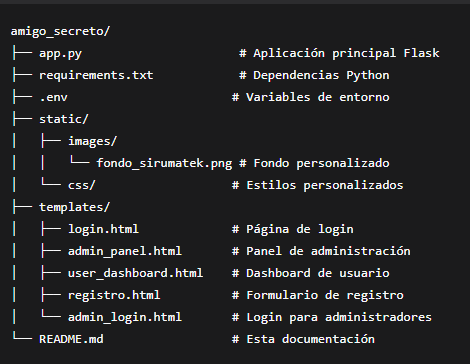
# Instalación y Configuración:
- Prerequisitos:

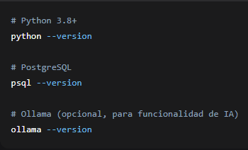

## Clonar y Configurar Entorno
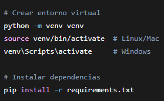

## Configurar Variables de Entorno
- Crear archivo .env: 

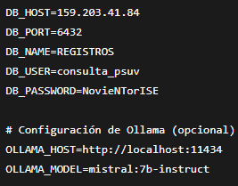

# Configuración de Base de Datos
- tb_participantes_ai

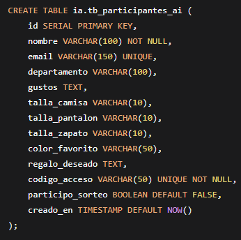

- tb_asignaciones_ai

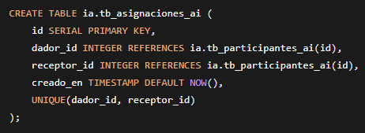

- tb_conversaciones_ai

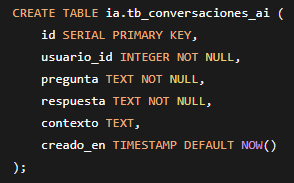

# Uso del Sistema
## Flujo de Usuario Normal:
- Registro: El usuario se registra con sus datos personales.
- Login: Accede con su email y código de acceso.
- Consulta: Ve la información de su amigo secreto (solo después del sorteo).
- Chat IA: Obtiene sugerencias de regalos manteniendo el anonimato.

## Flujo de Administrador
- Login Admin: Acceso con credenciales especiales.
- Gestión: Ver participantes, estadísticas y asignaciones.
- Sorteo: Realizar sorteo completo o fino según necesidad.
- Monitoreo: Supervisar el estado del sistema.

# API Endpoints
## Autenticación
- POST /login - Login de usuario normal.
- POST /admin/login - Login de administrador.
- POST /registro - Registro de nuevo usuario.

## Usuarios
- GET /dashboard - Dashboard del usuario.
- POST /api/chat-ia - Chat con IA personalizado.

# Administración
- GET /admin - Panel de administración.
- GET /api/admin/participantes - Listar participantes.
- GET /api/admin/estadisticas - Estadísticas del sistema.
- POST /api/admin/realizar-sorteo - Sorteo para nuevos participantes.
- POST /api/admin/sorteo-completo - Sorteo completo (reinicia todo).
- POST /api/admin/reiniciar-todo - Reinicio completo del sistema.
- GET /api/admin/asignaciones - Ver todas las asignaciones.

# Configuración de IA (Ollama)
## Instalación de Ollama
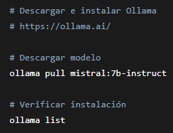

## Configuración del Chat IA
El sistema incluye protecciones para mantener el anonimato:
- No revela quién le regala al usuario.
- No revela asignaciones de otras personas.
- Solo proporciona sugerencias basadas en gustos del receptor.

# Despliegue
## Configuración para Producción 
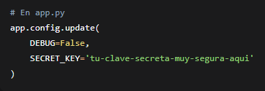

## Variables de Entorno de Producción
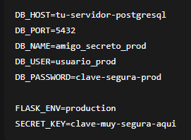

# Solución de Problemas
## Error: No se puede conectar a la base de datos
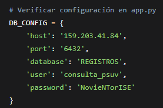

## Error: Ollama no responde
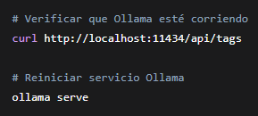

## Error: No se realizan los sorteos
- Verificar que haya al menos 2 participantes.
- Confirmar que el número de nuevos participantes sea par (para sorteo fino).
- Revisar los logs de la aplicación.